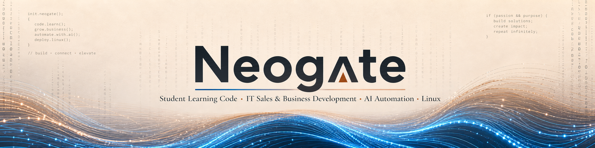

  

  
  
  
  
  

 

---

## 🖥️ Neogate

I’ve been into computers since I was 12.  
Neogate has been my handle ever since.

I come from IT sales and business development, working around engineers, CIOs, architects and decision-makers.

For years, I learned how to talk about technology.  
Then talking stopped being enough.

AI-assisted coding opened the door.  
Now I’m turning that entry point into a structured path: Python, debugging, APIs, automation, systems and real projects.

My goal is simple:  
to connect business logic with technical execution.

✍️ Still curious. 🛠️ Finally building.

---

## ⚡ Current Focus

### 🐍 Python, Code & Technical Foundations

AI-assisted coding was my entry point.

I started with vibe coding, then realized I needed to go deeper: Python, logic, debugging, algorithms, data structures, APIs and real projects.

I want to understand what I build, why it works, where it breaks and how to improve it.

### 🤖 AI as a Daily Companion

AI became part of my everyday life: thinking, learning, writing, organizing and building.

It helped me understand that coding was not out of reach, even starting from zero.

I now use it to ask better questions, clarify technical concepts, test ideas, debug problems and structure real work.

### 🖥️ Operating Systems & Digital Autonomy

I’m moving away from blind dependency on Windows.

Fedora is currently my lab for learning Linux, understanding systems and gaining more control over my environment.

I’m also considering moving to Apple soon, if it gives me the right balance between stability, performance, creative flow and long-term focus.

For me, the operating system is not just a tool.  
It shapes how you work, think, build and learn.

### 📡 APIs, Automation & Systems

I want to understand how systems communicate: APIs, data flows, automation logic, workflows, orchestration and business processes.

No-code and automation tools opened the door.  
Now I want to understand what happens underneath.

### 🧠 From Business Logic to Technical Execution

My background is business development, IT sales and B2B technology environments.

I’ve spent years around technical teams, decision-makers and business problems.

Now I’m connecting that experience with technical execution: users, problems, systems, workflows, automation and code.

---

## 🧪 Current Projects & Experiments

- 🗂️ Building a local file organization workflow for Windows and personal data cleanup
- 🐍 Writing Python scripts for automation, document processing and productivity
- 📡 Exploring API-based workflows and system-to-system communication
- 🤖 Testing AI-assisted coding workflows with ChatGPT, Codex and Claude Code
- 🧠 Studying how agent-based systems can support business automation
- 🐧 Experimenting with Fedora as a serious technical environment
- 🍎 Evaluating Apple as a possible long-term creative and technical environment

---

## 🛠️ Tools, Platforms & Current Stack

### Core Technical Work

### AI-Assisted Workflow

### Automation & Systems

### Systems, Hardware & Simulation

---

## 🔭 What I’m Building Toward

- 🐍 Building practical Python projects tied to real problems
- 📡 Understanding APIs, data flows and automation from the inside
- 🐧 Building a cleaner and more intentional technical environment
- 🍎 Exploring whether Apple can become a long-term environment for focus, stability and creative work
- 🤖 Using AI to accelerate learning, coding and problem-solving
- ⚙️ Designing API-native automation systems for business workflows
- 🔗 Connecting business understanding with technical execution
- 🧠 Learning in public, with curiosity, discipline and long-term thinking

---

## 🌊 Beyond Code

- 🖥️ Computers, hardware and clean setups. I just like this world.
- ✈️ Flight simulation, especially DCS World.
- 🤿 Freediving and breathwork.
- 📖 Philosophy, stoicism and questions about life.
- 🏃 Running, because it has always been part of the way I move through life.
---

## 🧭 Current Direction

I spent years talking about technology from the business side.

Now I want to understand it from the inside: how it works, how it connects, how it breaks and how to build with it.

Past security experiences pushed me to take digital autonomy more seriously.

Curiosity brought me here.  
AI opened the door.  
Now I’m learning the craft.
### 🔭 What I'm Building Toward

- 🐍 Getting serious with Python — real projects, real problems, real algorithms
- 📡 Understanding how systems talk to each other — APIs, data flows, agent orchestration
- 🐧 Moving to Linux full-time — control my environment, not be controlled by it
- 🤖 Building API-native multi-agent architectures for business automation
- ⚡ Using AI as a force multiplier — not a crutch, for someone who understands what's under the hood
- 🔗 Connecting business logic and technical execution — lived both sides, done leaving one to someone else
- 🤝 Connecting with people who build, think and share — ideas and knowledge travel further together

---
