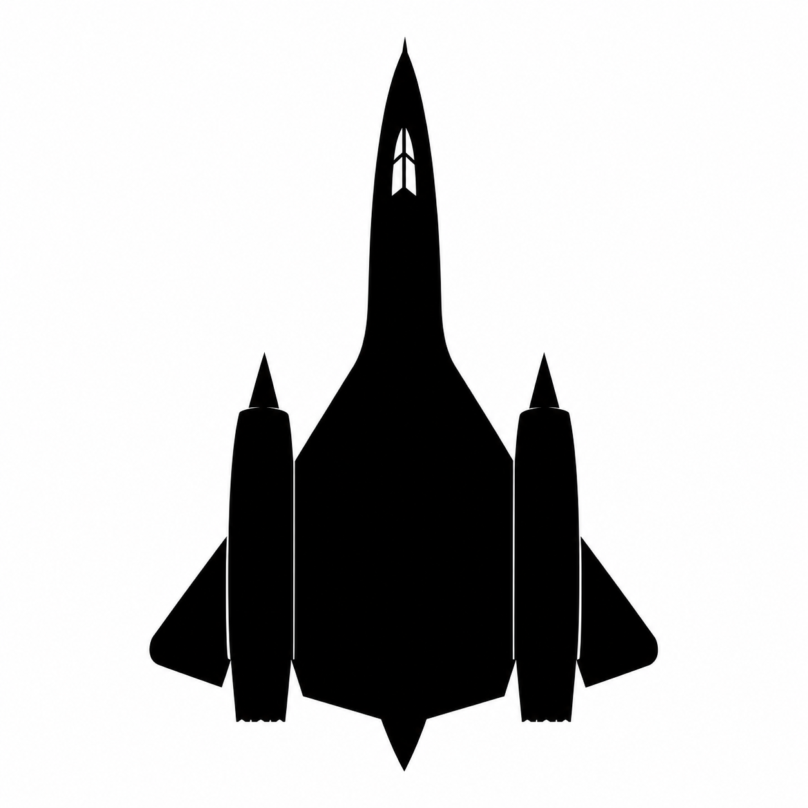

<h3 align="left">Hi, I’m El-Hadi 👋</h3>

🎓 Student exploring code, AI and automation  
💼 Background in IT sales & business development  
🧠 Curious about Python, AI agents, workflows and digital systems  
🖥️ Passionate about hardware, PC building and tech optimization  
 Passionate about flight simulation, especially DCS World  
🌊 Freediving enthusiast  
🧘 Interested in meditation, yoga, philosophy and self-mastery  
🚀 Learning by building, testing and iterating  

 

<h3>🧰 Tools & Interests</h3>

 <strong>Flight Simulation</strong>

 

<h3>🚀 What I’m exploring</h3>

- Python and code-assisted development
- Claude Code, Codex, Antigravity and AI-assisted coding workflows
- AI agents and automation workflows
- n8n, APIs and no-code / low-code systems
- productivity and personal knowledge management
- sales, lead generation and business-oriented tools
- hardware, PC building and system optimization
- flight simulation and technical environments such as DCS World
- the bridge between business thinking and technical execution

 

<h3>🌱 Personal interests</h3>

- Freediving and breathwork
- Meditation, yoga and philosophy
- Learning systems, self-mastery and continuous improvement
